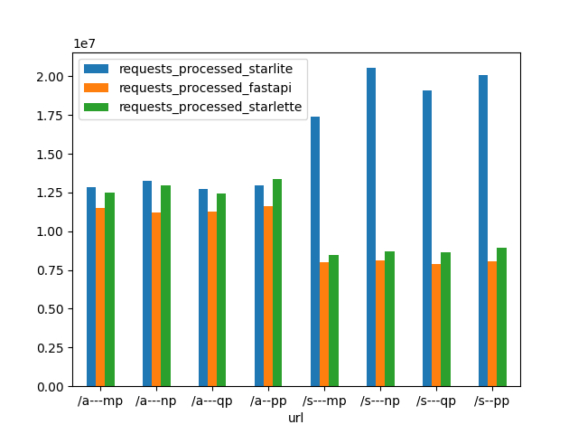

<div align="center">


[](https://sonarcloud.io/summary/new_code?id=Goldziher_starlite)
[](https://sonarcloud.io/summary/new_code?id=Goldziher_starlite)
[](https://sonarcloud.io/summary/new_code?id=Goldziher_starlite)
[](https://sonarcloud.io/summary/new_code?id=Goldziher_starlite)
[](https://sonarcloud.io/summary/new_code?id=Goldziher_starlite)
[](https://sonarcloud.io/summary/new_code?id=Goldziher_starlite)

[](https://discord.gg/X3FJqy8d2j)

[](https://itnext.io/introducing-starlite-3928adaa19ae)

</div>

# Starlite

Starlite is a light and flexible ASGI API framework. Using [Starlette](https://github.com/encode/starlette)
and [pydantic](https://github.com/samuelcolvin/pydantic) as foundations.

Check out the [Starlite documentation 📚](https://starlite-api.github.io/starlite/)

## Core Features

- 👉 Class based controllers
- 👉 Decorators based configuration
- 👉 Extended testing support
- 👉 Extensive typing support including inference, validation and parsing
- 👉 Full async (ASGI) support
- 👉 Layered dependency injection
- 👉 OpenAPI 3.1 schema generation with [Redoc](https://github.com/Redocly/redoc) UI
- 👉 Route guards based authorization
- 👉 Simple middleware and authentication
- 👉 Support for pydantic models and pydantic dataclasses
- 👉 Support for standard library dataclasses
- 👉 Support for SQLAlchemy declarative classes
- 👉 Plugin system to allow extending supported classes
- 👉 Ultra-fast json serialization and deserialization using [orjson](https://github.com/ijl/orjson)

## Installation

```shell
pip install starlite
```

## Relation to Starlette and FastAPI

Although Starlite uses the Starlette ASGI toolkit, it does not simply extend Starlette, as FastAPI does. Starlite uses
selective pieces of Starlette while implementing its own routing and parsing logic, the primary reason for this is to
enforce a set of best practices and discourage misuse. This is done to promote simplicity and scalability - Starlite is
simple to use, easy to learn, and unlike both Starlette and FastAPI - it keeps complexity low when scaling.

Additionally, Starlite is [faster than both FastAPI and Starlette](https://github.com/Goldziher/api-performance-tests):



Legend:

- a-: async, s-: sync
- np: no params, pp: path param, qp: query param, mp: mixed params

### Class Based Controllers

While supporting function based route handlers, Starlite also supports and promotes python OOP using class based
controllers:

```python title="my_app/controllers/user.py"
from typing import List, Optional

from pydantic import UUID4
from starlite import Controller, Partial, get, post, put, patch, delete
from datetime import datetime

from my_app.models import User


class UserController(Controller):
    path = "/users"

    @post()
    async def create_user(self, data: User) -> User:
        ...

    @get()
    async def list_users(self) -> List[User]:
        ...

    @get(path="/{date:int}")
    async def list_new_users(self, date: datetime) -> List[User]:
        ...

    @patch(path="/{user_id:uuid}")
    async def partially_update_user(self, user_id: UUID4, data: Partial[User]) -> User:
        ...

    @put(path="/{user_id:uuid}")
    async def update_user(self, user_id: UUID4, data: User) -> User:
        ...

    @get(path="/{user_name:str}")
    async def get_user_by_name(self, user_name: str) -> Optional[User]:
        ...

    @get(path="/{user_id:uuid}")
    async def get_user(self, user_id: UUID4) -> User:
        ...

    @delete(path="/{user_id:uuid}")
    async def delete_user(self, user_id: UUID4) -> User:
        ...
```

### ReDoc Automatic API Documentation

While running Starlite, you can view the [ReDoc API Documentation Page](https://redoc.ly/) by accessing it at the default
location of /schema or change the location using the [OpenAPIController](https://starlite-api.github.io/starlite/usage/12-openapi-and-redoc/#the-openapi-controller). If your app is running locally on port 8000 you can access the [ReDoc page at http://0.0.0.0:8000/schema](http://0.0.0.0:8000/schema).

### Data Parsing, Type Hints and Pydantic

One key difference between Starlite and Starlette/FastAPI is in parsing of form data and query parameters- Starlite
supports mixed form data and has faster and better query parameter parsing.

Starlite is rigorously typed, and it enforces typing. For example, if you forget to type a return value for a route
handler, an exception will be raised. The reason for this is that Starlite uses typing data to generate OpenAPI specs,
as well as to validate and parse data. Thus typing is absolutely essential to the framework.

Furthermore, Starlite allows extending its support using plugins.

### SQL Alchemy Support, Plugin System and DTOs

Starlite has a plugin system that allows the user to extend serialization/deserialization, OpenAPI generation and other
features. It ships with a builtin plugin for SQL Alchemy, which allows the user to use SQL Alchemy declarative classes
"natively", i.e. as type parameters that will be serialized/deserialized and to return them as values from route
handlers.

Starlite also supports the programmatic creation of DTOs with a `DTOFactory` class, which also supports the use of plugins.

### OpenAPI

Starlite has custom logic to generate OpenAPI 3.1.0 schema, the latest version. The schema generated by Starlite is
significantly more complete and more correct than those generated by FastAPI, and they include optional generation of
examples using the `pydantic-factories` library.

### Dependency Injection

Starlite has a simple but powerful DI system inspired by pytest. You can define named dependencies - sync or async - at
different levels of the application, and then selective use or overwrite them.

### Middleware

Starlite supports the Starlette Middleware system while simplifying it and offering builtin configuration of CORS and
some other middlewares.

### Route Guards

Starlite has an authorization mechanism called `guards`, which allows the user to define guard functions at different
level of the application (app, router, controller etc.) and validate the request before hitting the route handler
function.

### Request Life Cycle Hooks

Starlite supports request life cycle hooks, similarly to Flask - i.e. `before_request` and `after_request`

## Contributing

Starlite is open to contributions big and small. You can always [join our discord](https://discord.gg/X3FJqy8d2j) server
to discuss contributions and project maintenance. For guidelines on how to contribute, please
see [the contribution guide](CONTRIBUTING.md).
