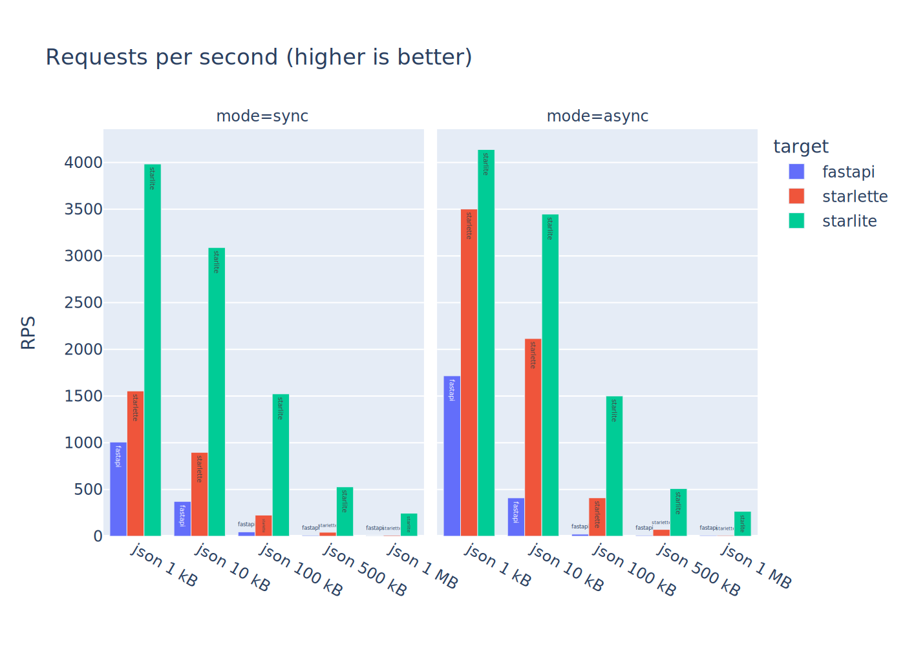
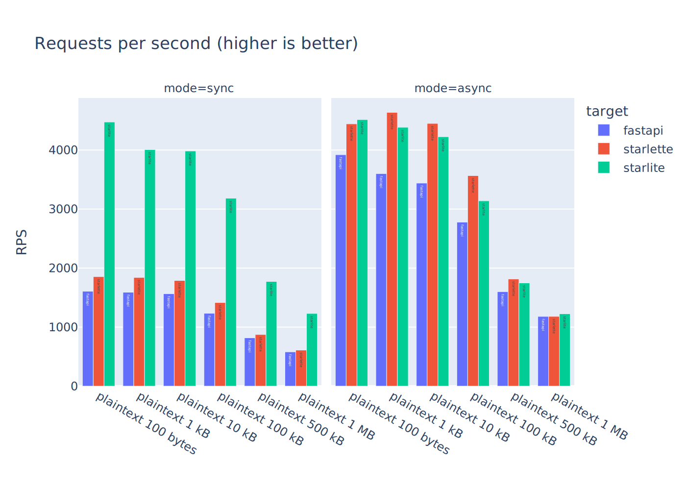

<!-- markdownlint-disable -->

<!-- markdownlint-restore -->

<div align="center">


[](https://sonarcloud.io/summary/new_code?id=starlite-api_starlite)

[](https://sonarcloud.io/summary/new_code?id=starlite-api_starlite)
[](https://sonarcloud.io/summary/new_code?id=starlite-api_starlite)
[](https://sonarcloud.io/summary/new_code?id=starlite-api_starlite)
[](https://sonarcloud.io/summary/new_code?id=starlite-api_starlite)

<!-- prettier-ignore-start -->
<!-- ALL-CONTRIBUTORS-BADGE:START - Do not remove or modify this section -->
[](#contributors-)
<!-- ALL-CONTRIBUTORS-BADGE:END -->
<!-- prettier-ignore-end -->

[](https://discord.gg/X3FJqy8d2j)
[](https://matrix.to/#/#starlitespace:matrix.org)

[](https://itnext.io/introducing-starlite-3928adaa19ae)

</div>

# Starlite

Starlite is a powerful, performant, flexible and opinionated ASGI framework,
offering first class typing support and a full [Pydantic](https://github.com/samuelcolvin/pydantic)
integration.

Check out the [documentation 📚](https://starlite-api.github.io/starlite/).

## Installation

```shell
pip install starlite
```

## Quick Start

```python
from starlite import Starlite, get


@get("/")
def hello_world() -> dict[str, str]:
    """Keeping the tradition alive with hello world."""
    return {"hello": "world"}


app = Starlite(route_handlers=[hello_world])
```

## Core Features

- [Class based controllers](#class-based-controllers)
- [Dependency Injection](#dependency-injection)
- [Validation and Parsing](#data-parsing-type-hints-and-pydantic) using [Pydantic](https://github.com/samuelcolvin/pydantic)
- [Layered Middleware](#middleware)
- [Plugin System](#plugin-system-orm-support-and-dtos)
- [OpenAPI 3.1 schema generation](#openapi)
- [Life Cycle Hooks](#request-life-cycle-hooks)
- [Route Guards based Authorization](#route-guards)
- Layered Parameter declaration
- SQLAlchemy Support (via plugin)
- Piccolo ORM Support (via plugin)
- Tortoise ORM Support (via plugin)
- Extended testing support
- [Automatic API documentation with](#redoc-swagger-ui-and-stoplight-elements-api-documentation):
  - [Redoc](https://github.com/Redocly/redoc)
  - [Stoplight Elements](https://github.com/stoplightio/elements)
  - [Swagger-UI](https://swagger.io/tools/swagger-ui/)
- Support for dataclasses and `TypedDict`
- [Trio](https://trio.readthedocs.io/en/stable/) support (built-in, via [AnyIO](https://anyio.readthedocs.io/))
- Ultra-fast json serialization and deserialization using [msgspec](https://github.com/jcrist/msgspec)

## Example Applications

- [starlite-pg-redis-docker](https://github.com/starlite-api/starlite-pg-redis-docker): In addition to Starlite, this
  demonstrates a pattern of application modularity, SQLAlchemy 2.0 ORM, Redis cache connectivity, and more. Like all
  Starlite projects, this application is open to contributions, big and small.
- [starlite-hello-world](https://github.com/starlite-api/starlite-hello-world): A bare-minimum application setup. Great
  for testing and POC work.

## The name `Starlite` and relation to `Starlette`

Starlite was originally built using the [Starlette ASGI toolkit](https://www.starlette.io/). The name `Starlite` was
meant to show this relation. But, over time Starlite grew in capabilities and complexity, and eventually we no longer needed
to depend on Starlette. From version `1.39.0` onward `starlette` was removed as a dependency of Starlite, and the name now carries
this piece of history with it.

## Performance

Starlite is fast. It is on par with, or significantly faster than comparable ASGI frameworks.

You can see and run the benchmarks [here](https://github.com/starlite-api/api-performance-tests),
or read more about it [here](https://starlite-api.github.io/starlite/benchmarks) in our documentation.

### JSON Benchmarks



### Plaintext Benchmarks



## Features

### Class Based Controllers

While supporting function based route handlers, Starlite also supports and promotes python OOP using class based
controllers:

```python title="my_app/controllers/user.py"
from typing import List, Optional

from pydantic import UUID4
from starlite import Controller, Partial, get, post, put, patch, delete
from datetime import datetime

from my_app.models import User


class UserController(Controller):
    path = "/users"

    @post()
    async def create_user(self, data: User) -> User:
        ...

    @get()
    async def list_users(self) -> List[User]:
        ...

    @get(path="/{date:int}")
    async def list_new_users(self, date: datetime) -> List[User]:
        ...

    @patch(path="/{user_id:uuid}")
    async def partial_update_user(self, user_id: UUID4, data: Partial[User]) -> User:
        ...

    @put(path="/{user_id:uuid}")
    async def update_user(self, user_id: UUID4, data: User) -> User:
        ...

    @get(path="/{user_name:str}")
    async def get_user_by_name(self, user_name: str) -> Optional[User]:
        ...

    @get(path="/{user_id:uuid}")
    async def get_user(self, user_id: UUID4) -> User:
        ...

    @delete(path="/{user_id:uuid}")
    async def delete_user(self, user_id: UUID4) -> None:
        ...
```

### Data Parsing, Type Hints and Pydantic

One key difference between Starlite and Starlette/FastAPI is in parsing of form data and query parameters- Starlite
supports mixed form data and has faster and better query parameter parsing.

Starlite is rigorously typed, and it enforces typing. For example, if you forget to type a return value for a route
handler, an exception will be raised. The reason for this is that Starlite uses typing data to generate OpenAPI specs,
as well as to validate and parse data. Thus typing is absolutely essential to the framework.

Furthermore, Starlite allows extending its support using plugins.

### Plugin System, ORM support and DTOs

Starlite has a plugin system that allows the user to extend serialization/deserialization, OpenAPI generation and other
features. It ships with a builtin plugin for SQL Alchemy, which allows the user to use SQLAlchemy declarative classes
"natively", i.e. as type parameters that will be serialized/deserialized and to return them as values from route
handlers.

Starlite also supports the programmatic creation of DTOs with a `DTOFactory` class, which also supports the use of
plugins.

### OpenAPI

Starlite has custom logic to generate OpenAPI 3.1.0 schema, the latest version. The schema generated by Starlite is
significantly more complete and more correct than those generated by FastAPI, and they include optional generation of
examples using the `pydantic-factories` library.

#### ReDoc, Swagger-UI and Stoplight Elements API Documentation

Starlite serves the documentation from the generated OpenAPI schema with:

- [ReDoc](https://redoc.ly/)
- [Swagger-UI](https://swagger.io/tools/swagger-ui/)
- [Stoplight Elements](https://github.com/stoplightio/elements)

All these are available and enabled by default.

### Dependency Injection

Starlite has a simple but powerful DI system inspired by pytest. You can define named dependencies - sync or async - at
different levels of the application, and then selective use or overwrite them.

```python
from starlite import Starlite, Provide, get


async def my_dependency() -> str:
    ...


@get("/")
async def index(injected: str) -> str:
    return injected


app = Starlite([index], dependencies={"injected": Provide(my_dependency)})
```

### Middleware

Starlite supports typical ASGI middleware and ships with middlewares to handle things such as

- CORS
- CSRF
- Rate limiting
- GZip and Brotli compression
- Client- and server-side sessions

### Route Guards

Starlite has an authorization mechanism called `guards`, which allows the user to define guard functions at different
level of the application (app, router, controller etc.) and validate the request before hitting the route handler
function.

```python
from starlite import (
    Starlite,
    get,
    ASGIConnection,
    NotAuthorizedException,
    BaseRouteHandler,
)


async def is_authorized(connection: ASGIConnection, handler: BaseRouteHandler) -> None:
    # validate authorization
    # if not authorized, raise NotAuthorizedException
    raise NotAuthorizedException()


@get("/", guards=[is_authorized])
async def index() -> None:
    ...


app = Starlite([index])
```

### Request Life Cycle Hooks

Starlite supports request life cycle hooks, similarly to Flask - i.e. `before_request` and `after_request`

## Contributing

Starlite is open to contributions big and small. You can always [join our discord](https://discord.gg/X3FJqy8d2j) server
or [join our Matrix](https://matrix.to/#/#starlitespace:matrix.org) space
to discuss contributions and project maintenance. For guidelines on how to contribute, please
see [the contribution guide](CONTRIBUTING.md).

## Contributors ✨

Thanks goes to these wonderful people ([emoji key](https://allcontributors.org/docs/en/emoji-key)):

<!-- ALL-CONTRIBUTORS-LIST:START - Do not remove or modify this section -->
<!-- prettier-ignore-start -->
<!-- markdownlint-disable -->
<table>
  <tbody>
    <tr>
      <td align="center"><a href="https://www.linkedin.com/in/nhirschfeld/"><br /><sub><b>Na'aman Hirschfeld</b></sub></a><br /><a href="#maintenance-Goldziher" title="Maintenance">🚧</a> <a href="https://github.com/starlite-api/starlite/commits?author=Goldziher" title="Code">💻</a> <a href="https://github.com/starlite-api/starlite/commits?author=Goldziher" title="Documentation">📖</a></td>
      <td align="center"><a href="https://github.com/peterschutt"><br /><sub><b>Peter Schutt</b></sub></a><br /><a href="#maintenance-peterschutt" title="Maintenance">🚧</a> <a href="https://github.com/starlite-api/starlite/commits?author=peterschutt" title="Code">💻</a> <a href="https://github.com/starlite-api/starlite/commits?author=peterschutt" title="Documentation">📖</a></td>
      <td align="center"><a href="https://ashwinvin.github.io"><br /><sub><b>Ashwin Vinod</b></sub></a><br /><a href="https://github.com/starlite-api/starlite/commits?author=ashwinvin" title="Code">💻</a> <a href="https://github.com/starlite-api/starlite/commits?author=ashwinvin" title="Documentation">📖</a></td>
      <td align="center"><a href="http://www.damiankress.de"><br /><sub><b>Damian</b></sub></a><br /><a href="https://github.com/starlite-api/starlite/commits?author=dkress59" title="Documentation">📖</a></td>
      <td align="center"><a href="https://remotepixel.ca"><br /><sub><b>Vincent Sarago</b></sub></a><br /><a href="https://github.com/starlite-api/starlite/commits?author=vincentsarago" title="Code">💻</a></td>
      <td align="center"><a href="https://hotfix.guru"><br /><sub><b>Jonas Krüger Svensson</b></sub></a><br /><a href="#platform-JonasKs" title="Packaging/porting to new platform">📦</a></td>
      <td align="center"><a href="https://github.com/sondrelg"><br /><sub><b>Sondre Lillebø Gundersen</b></sub></a><br /><a href="#platform-sondrelg" title="Packaging/porting to new platform">📦</a></td>
    </tr>
    <tr>
      <td align="center"><a href="https://github.com/vrslev"><br /><sub><b>Lev</b></sub></a><br /><a href="https://github.com/starlite-api/starlite/commits?author=vrslev" title="Code">💻</a> <a href="#ideas-vrslev" title="Ideas, Planning, & Feedback">🤔</a></td>
      <td align="center"><a href="https://github.com/timwedde"><br /><sub><b>Tim Wedde</b></sub></a><br /><a href="https://github.com/starlite-api/starlite/commits?author=timwedde" title="Code">💻</a></td>
      <td align="center"><a href="https://github.com/tclasen"><br /><sub><b>Tory Clasen</b></sub></a><br /><a href="https://github.com/starlite-api/starlite/commits?author=tclasen" title="Code">💻</a></td>
      <td align="center"><a href="http://t.me/Bobronium"><br /><sub><b>Arseny Boykov</b></sub></a><br /><a href="https://github.com/starlite-api/starlite/commits?author=Bobronium" title="Code">💻</a> <a href="#ideas-Bobronium" title="Ideas, Planning, & Feedback">🤔</a></td>
      <td align="center"><a href="https://github.com/yudjinn"><br /><sub><b>Jacob Rodgers</b></sub></a><br /><a href="#example-yudjinn" title="Examples">💡</a></td>
      <td align="center"><a href="https://github.com/danesolberg"><br /><sub><b>Dane Solberg</b></sub></a><br /><a href="https://github.com/starlite-api/starlite/commits?author=danesolberg" title="Code">💻</a></td>
      <td align="center"><a href="https://github.com/madlad33"><br /><sub><b>madlad33</b></sub></a><br /><a href="https://github.com/starlite-api/starlite/commits?author=madlad33" title="Code">💻</a></td>
    </tr>
    <tr>
      <td align="center"><a href="http://matthewtyleraylward.com"><br /><sub><b>Matthew Aylward </b></sub></a><br /><a href="https://github.com/starlite-api/starlite/commits?author=Butch78" title="Code">💻</a></td>
      <td align="center"><a href="https://github.com/Joko013"><br /><sub><b>Jan Klima</b></sub></a><br /><a href="https://github.com/starlite-api/starlite/commits?author=Joko013" title="Code">💻</a></td>
      <td align="center"><a href="https://github.com/i404788"><br /><sub><b>C2D</b></sub></a><br /><a href="https://github.com/starlite-api/starlite/commits?author=i404788" title="Tests">⚠️</a></td>
      <td align="center"><a href="https://github.com/to-ph"><br /><sub><b>to-ph</b></sub></a><br /><a href="https://github.com/starlite-api/starlite/commits?author=to-ph" title="Code">💻</a></td>
      <td align="center"><a href="https://imbev.gitlab.io/site"><br /><sub><b>imbev</b></sub></a><br /><a href="https://github.com/starlite-api/starlite/commits?author=imbev" title="Documentation">📖</a></td>
      <td align="center"><a href="https://git.roboces.dev/catalin"><br /><sub><b>cătălin</b></sub></a><br /><a href="https://github.com/starlite-api/starlite/commits?author=185504a9" title="Code">💻</a></td>
      <td align="center"><a href="https://github.com/Seon82"><br /><sub><b>Seon82</b></sub></a><br /><a href="https://github.com/starlite-api/starlite/commits?author=Seon82" title="Documentation">📖</a></td>
    </tr>
    <tr>
      <td align="center"><a href="https://github.com/slavugan"><br /><sub><b>Slava</b></sub></a><br /><a href="https://github.com/starlite-api/starlite/commits?author=slavugan" title="Code">💻</a></td>
      <td align="center"><a href="https://github.com/Harry-Lees"><br /><sub><b>Harry</b></sub></a><br /><a href="https://github.com/starlite-api/starlite/commits?author=Harry-Lees" title="Code">💻</a> <a href="https://github.com/starlite-api/starlite/commits?author=Harry-Lees" title="Documentation">📖</a></td>
      <td align="center"><a href="https://github.com/cofin"><br /><sub><b>Cody Fincher</b></sub></a><br /><a href="https://github.com/starlite-api/starlite/commits?author=cofin" title="Code">💻</a> <a href="https://github.com/starlite-api/starlite/commits?author=cofin" title="Documentation">📖</a> <a href="#maintenance-cofin" title="Maintenance">🚧</a></td>
      <td align="center"><a href="https://www.patreon.com/cclauss"><br /><sub><b>Christian Clauss</b></sub></a><br /><a href="https://github.com/starlite-api/starlite/commits?author=cclauss" title="Documentation">📖</a></td>
      <td align="center"><a href="https://github.com/josepdaniel"><br /><sub><b>josepdaniel</b></sub></a><br /><a href="https://github.com/starlite-api/starlite/commits?author=josepdaniel" title="Code">💻</a></td>
      <td align="center"><a href="https://github.com/devtud"><br /><sub><b>devtud</b></sub></a><br /><a href="https://github.com/starlite-api/starlite/issues?q=author%3Adevtud" title="Bug reports">🐛</a></td>
      <td align="center"><a href="https://github.com/nramos0"><br /><sub><b>Nicholas Ramos</b></sub></a><br /><a href="https://github.com/starlite-api/starlite/commits?author=nramos0" title="Code">💻</a></td>
    </tr>
    <tr>
      <td align="center"><a href="https://twitter.com/seladb"><br /><sub><b>seladb</b></sub></a><br /><a href="https://github.com/starlite-api/starlite/commits?author=seladb" title="Documentation">📖</a> <a href="https://github.com/starlite-api/starlite/commits?author=seladb" title="Code">💻</a></td>
      <td align="center"><a href="https://github.com/aedify-swi"><br /><sub><b>Simon Wienhöfer</b></sub></a><br /><a href="https://github.com/starlite-api/starlite/commits?author=aedify-swi" title="Code">💻</a></td>
      <td align="center"><a href="https://github.com/mobiusxs"><br /><sub><b>MobiusXS</b></sub></a><br /><a href="https://github.com/starlite-api/starlite/commits?author=mobiusxs" title="Code">💻</a></td>
      <td align="center"><a href="http://aidansimard.dev"><br /><sub><b>Aidan Simard</b></sub></a><br /><a href="https://github.com/starlite-api/starlite/commits?author=Aidan-Simard" title="Documentation">📖</a></td>
      <td align="center"><a href="https://github.com/waweber"><br /><sub><b>wweber</b></sub></a><br /><a href="https://github.com/starlite-api/starlite/commits?author=waweber" title="Code">💻</a></td>
      <td align="center"><a href="http://scolvin.com"><br /><sub><b>Samuel Colvin</b></sub></a><br /><a href="https://github.com/starlite-api/starlite/commits?author=samuelcolvin" title="Code">💻</a></td>
      <td align="center"><a href="https://github.com/toudi"><br /><sub><b>Mateusz Mikołajczyk</b></sub></a><br /><a href="https://github.com/starlite-api/starlite/commits?author=toudi" title="Code">💻</a></td>
    </tr>
    <tr>
      <td align="center"><a href="https://github.com/Alex-CodeLab"><br /><sub><b>Alex </b></sub></a><br /><a href="https://github.com/starlite-api/starlite/commits?author=Alex-CodeLab" title="Code">💻</a></td>
      <td align="center"><a href="https://github.com/odiseo0"><br /><sub><b>Odiseo</b></sub></a><br /><a href="https://github.com/starlite-api/starlite/commits?author=odiseo0" title="Documentation">📖</a></td>
      <td align="center"><a href="https://github.com/ingjavierpinilla"><br /><sub><b>Javier  Pinilla</b></sub></a><br /><a href="https://github.com/starlite-api/starlite/commits?author=ingjavierpinilla" title="Code">💻</a></td>
      <td align="center"><a href="https://github.com/Chaoyingz"><br /><sub><b>Chaoying</b></sub></a><br /><a href="https://github.com/starlite-api/starlite/commits?author=Chaoyingz" title="Documentation">📖</a></td>
      <td align="center"><a href="https://github.com/infohash"><br /><sub><b>infohash</b></sub></a><br /><a href="https://github.com/starlite-api/starlite/commits?author=infohash" title="Code">💻</a></td>
      <td align="center"><a href="https://www.linkedin.com/in/john-ingles/"><br /><sub><b>John Ingles</b></sub></a><br /><a href="https://github.com/starlite-api/starlite/commits?author=john-ingles" title="Code">💻</a></td>
      <td align="center"><a href="https://github.com/h0rn3t"><br /><sub><b>Eugene</b></sub></a><br /><a href="https://github.com/starlite-api/starlite/commits?author=h0rn3t" title="Tests">⚠️</a> <a href="https://github.com/starlite-api/starlite/commits?author=h0rn3t" title="Code">💻</a></td>
    </tr>
    <tr>
      <td align="center"><a href="https://github.com/jonadaly"><br /><sub><b>Jon Daly</b></sub></a><br /><a href="https://github.com/starlite-api/starlite/commits?author=jonadaly" title="Documentation">📖</a> <a href="https://github.com/starlite-api/starlite/commits?author=jonadaly" title="Code">💻</a></td>
      <td align="center"><a href="https://harshallaheri.me/"><br /><sub><b>Harshal Laheri</b></sub></a><br /><a href="https://github.com/starlite-api/starlite/commits?author=Harshal6927" title="Code">💻</a> <a href="https://github.com/starlite-api/starlite/commits?author=Harshal6927" title="Documentation">📖</a></td>
      <td align="center"><a href="https://github.com/sorasful"><br /><sub><b>Téva KRIEF</b></sub></a><br /><a href="https://github.com/starlite-api/starlite/commits?author=sorasful" title="Code">💻</a></td>
      <td align="center"><a href="https://github.com/jtraub"><br /><sub><b>Konstantin Mikhailov</b></sub></a><br /><a href="https://github.com/starlite-api/starlite/commits?author=jtraub" title="Documentation">📖</a> <a href="https://github.com/starlite-api/starlite/commits?author=jtraub" title="Code">💻</a></td>
      <td align="center"><a href="http://linkedin.com/in/mitchell-henry334/"><br /><sub><b>Mitchell Henry</b></sub></a><br /><a href="https://github.com/starlite-api/starlite/commits?author=devmitch" title="Documentation">📖</a></td>
      <td align="center"><a href="https://github.com/chbndrhnns"><br /><sub><b>chbndrhnns</b></sub></a><br /><a href="https://github.com/starlite-api/starlite/commits?author=chbndrhnns" title="Documentation">📖</a></td>
      <td align="center"><a href="https://github.com/nielsvanhooy"><br /><sub><b>nielsvanhooy</b></sub></a><br /><a href="https://github.com/starlite-api/starlite/commits?author=nielsvanhooy" title="Code">💻</a></td>
    </tr>
    <tr>
      <td align="center"><a href="https://github.com/provinzkraut"><br /><sub><b>provinzkraut</b></sub></a><br /><a href="https://github.com/starlite-api/starlite/commits?author=provinzkraut" title="Tests">⚠️</a> <a href="https://github.com/starlite-api/starlite/commits?author=provinzkraut" title="Code">💻</a></td>
      <td align="center"><a href="https://github.com/jab"><br /><sub><b>Joshua Bronson</b></sub></a><br /><a href="https://github.com/starlite-api/starlite/commits?author=jab" title="Documentation">📖</a></td>
      <td align="center"><a href="http://linkedin.com/in/roman-reznikov"><br /><sub><b>Roman Reznikov</b></sub></a><br /><a href="https://github.com/starlite-api/starlite/commits?author=ReznikovRoman" title="Documentation">📖</a></td>
      <td align="center"><a href="http://mookrs.com"><br /><sub><b>mookrs</b></sub></a><br /><a href="https://github.com/starlite-api/starlite/commits?author=mookrs" title="Documentation">📖</a></td>
      <td align="center"><a href="http://mike.depalatis.net"><br /><sub><b>Mike DePalatis</b></sub></a><br /><a href="https://github.com/starlite-api/starlite/commits?author=mivade" title="Documentation">📖</a></td>
      <td align="center"><a href="https://github.com/pemocarlo"><br /><sub><b>Carlos Alberto Pérez-Molano</b></sub></a><br /><a href="https://github.com/starlite-api/starlite/commits?author=pemocarlo" title="Documentation">📖</a></td>
      <td align="center"><a href="https://www.bestcryptocodes.com"><br /><sub><b>ThinksFast</b></sub></a><br /><a href="https://github.com/starlite-api/starlite/commits?author=ThinksFast" title="Tests">⚠️</a></td>
    </tr>
    <tr>
      <td align="center"><a href="https://github.com/ottermata"><br /><sub><b>Christopher Krause</b></sub></a><br /><a href="https://github.com/starlite-api/starlite/commits?author=ottermata" title="Code">💻</a></td>
      <td align="center"><a href="http://www.kylesmith.me"><br /><sub><b>Kyle Smith</b></sub></a><br /><a href="https://github.com/starlite-api/starlite/commits?author=smithk86" title="Code">💻</a> <a href="https://github.com/starlite-api/starlite/commits?author=smithk86" title="Documentation">📖</a></td>
      <td align="center"><a href="https://github.com/scott2b"><br /><sub><b>Scott Bradley</b></sub></a><br /><a href="https://github.com/starlite-api/starlite/issues?q=author%3Ascott2b" title="Bug reports">🐛</a></td>
      <td align="center"><a href="https://www.linkedin.com/in/srikanthccv/"><br /><sub><b>Srikanth Chekuri</b></sub></a><br /><a href="https://github.com/starlite-api/starlite/commits?author=srikanthccv" title="Tests">⚠️</a> <a href="https://github.com/starlite-api/starlite/commits?author=srikanthccv" title="Documentation">📖</a></td>
      <td align="center"><a href="https://lonelyviking.com"><br /><sub><b>Michael Bosch</b></sub></a><br /><a href="https://github.com/starlite-api/starlite/commits?author=LonelyVikingMichael" title="Documentation">📖</a></td>
      <td align="center"><a href="https://github.com/sssssss340"><br /><sub><b>sssssss340</b></sub></a><br /><a href="https://github.com/starlite-api/starlite/issues?q=author%3Asssssss340" title="Bug reports">🐛</a></td>
      <td align="center"><a href="https://github.com/ste-pool"><br /><sub><b>ste-pool</b></sub></a><br /><a href="https://github.com/starlite-api/starlite/commits?author=ste-pool" title="Code">💻</a></td>
    </tr>
    <tr>
      <td align="center"><a href="https://github.com/Alc-Alc"><br /><sub><b>Alc-Alc</b></sub></a><br /><a href="https://github.com/starlite-api/starlite/commits?author=Alc-Alc" title="Documentation">📖</a></td>
      <td align="center"><a href="http://asomethings.com"><br /><sub><b>asomethings</b></sub></a><br /><a href="https://github.com/starlite-api/starlite/commits?author=asomethings" title="Code">💻</a></td>
      <td align="center"><a href="https://github.com/garburator"><br /><sub><b>Garry Bullock</b></sub></a><br /><a href="https://github.com/starlite-api/starlite/commits?author=garburator" title="Documentation">📖</a></td>
      <td align="center"><a href="https://github.com/NiclasHaderer"><br /><sub><b>Niclas Haderer</b></sub></a><br /><a href="https://github.com/starlite-api/starlite/commits?author=NiclasHaderer" title="Code">💻</a></td>
      <td align="center"><a href="https://github.com/dialvarezs"><br /><sub><b>Diego Alvarez</b></sub></a><br /><a href="https://github.com/starlite-api/starlite/commits?author=dialvarezs" title="Documentation">📖</a> <a href="https://github.com/starlite-api/starlite/commits?author=dialvarezs" title="Code">💻</a></td>
      <td align="center"><a href="https://www.rgare.com"><br /><sub><b>Jason Nance</b></sub></a><br /><a href="https://github.com/starlite-api/starlite/commits?author=rgajason" title="Documentation">📖</a></td>
    </tr>
  </tbody>
</table>

<!-- markdownlint-restore -->
<!-- prettier-ignore-end -->

<!-- ALL-CONTRIBUTORS-LIST:END -->

This project follows the [all-contributors](https://github.com/all-contributors/all-contributors) specification.
Contributions of any kind welcome!
