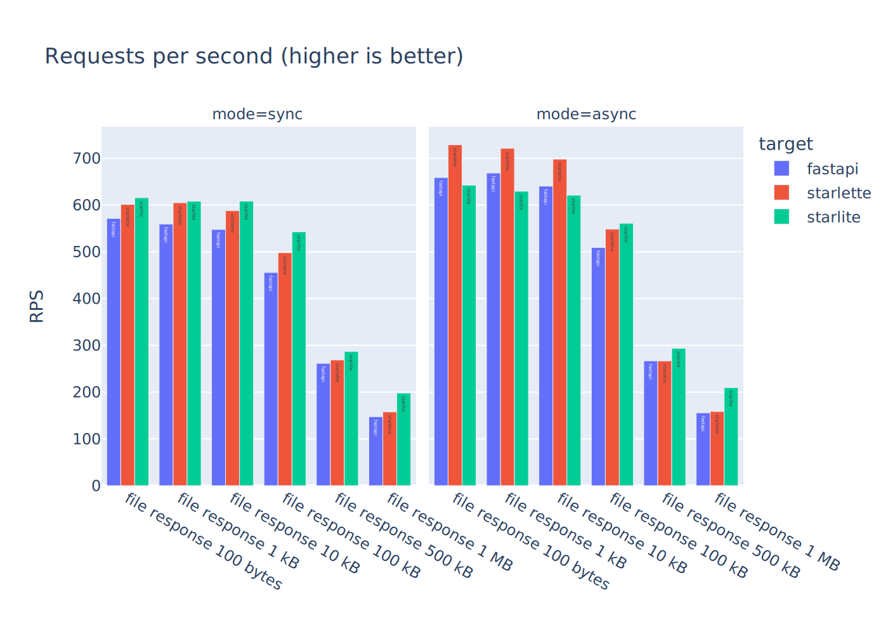
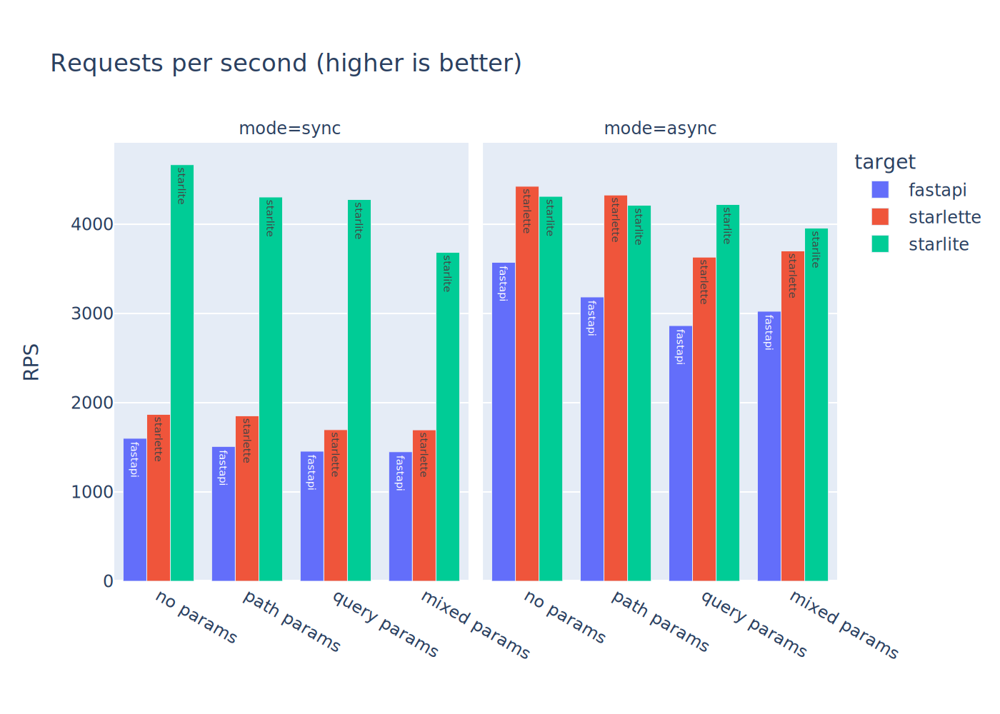
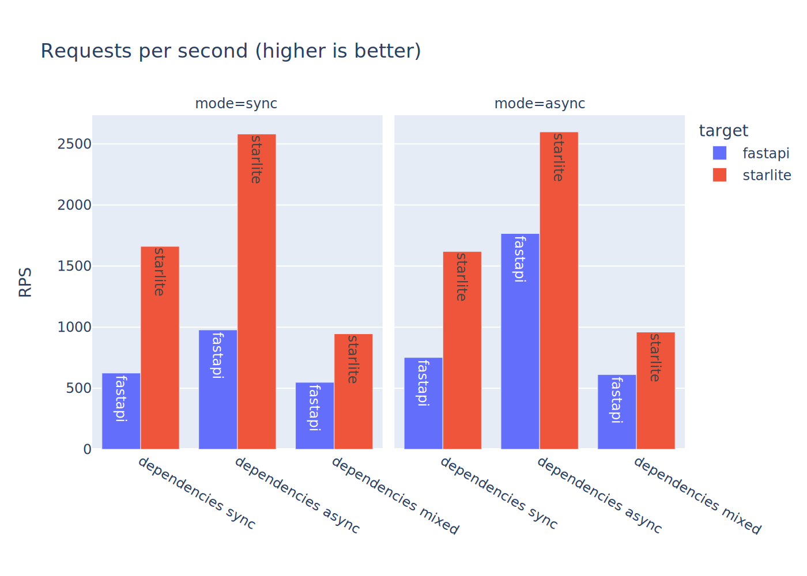
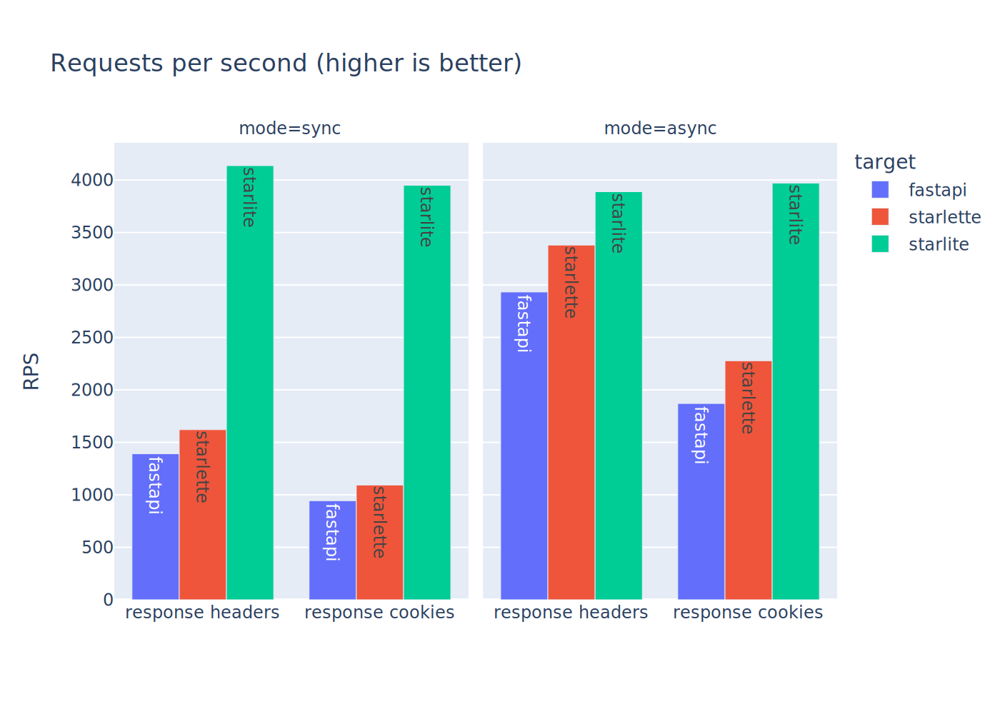

# Benchmarks

## Methodology
- Benchmarking is done using the [bomardier](https://github.com/codesenberg/bombardier) benchmarking tool.
- Benchmarks are run on a dedicated machine, with a base Debian 11 installation. 
- Each framework is contained within its own docker container, running on a dedicated CPU core (using the `cset shield` command the `--cpuset-cpus` option for docker)
- Tests for the frameworks are written to make them as comparable as possible while completing the same tasks (you can see them [here](https://github.com/starlite-api/api-performance-tests/tree/main/frameworks))
- Each application is run using [uvicorn](https://www.uvicorn.org/) with **one worker** and [uvloop](https://uvloop.readthedocs.io/)
- Test data has been randomly generated and is being imported from a shared module

### Test modes
Two different test modes are executed:

#### Requests per second
This is a full load tests, in which requests are sent to the server as fast as it can handle them.
This is done over a period for 60 seconds, after a warmup period of 5 seconds.

#### Latency under normal load
Latency is measured across 1000 requests, with a rate limit of 20 requests per second.

## Results

!!! info
    If a result is missing for a specific framework that means either

    - It does not support this functionality (this will be mentioned in the test description)
    - More than 0.1% of responses were dropped / erroneous

### JSON
Serializing a dictionary into JSON

??? info "Full series"
    

### Serialization
_(only supported by `Starlite` and `FastAPI`)_

??? info "Full series"
    

### Files

??? info "Full series"
    

### Path and query parameter handling
_All responses return "No Content"_

- No params: No path parameters
- Path params: Single path parameter, coerced into an integer
- Query params: Single query parameter, coerced into an integer
- Mixed params: A path and a query parameters, coerced into integers

??? info "Full series"
    

### Dependency injection
<small>_(not supported by `Starlette`)_</small>

- Resolving 3 nested synchronous dependencies
- Resolving 3 nested asynchronous dependencies (only supported by `Starlite` and `FastAPI`)
- Resolving 3 nested synchronous, and 3 nested asynchronous dependencies (only supported by `Starlite` and `FastAPI`)

??? info "Full series"
    

### Modifying responses
_All responses return "No Content"_

??? info "Full series"
    

### Plaintext

??? info "Full series"
    

## Interpreting the results
An interpretation of these results should be approached with caution, as is the case
for nearly all benchmarks. A high score in a test does not necessarily translate to
high performance of **your** application in **your** use case. For almost any test
you can probably write an app that performs better or worse at a comparable task 
**in your scenario**.

While trying to design the tests in a way that simulate somewhat realistic scenarios, 
they can never give an exact representation of how a real world application, where, 
aside from the workload, many other factors come into play. These tests were mainly written 
to be used internally for starlite development, to help us locate the source of some 
performance regression we were experiencing.

If you're interested in a good read about the general value and inherent weaknesses
of framework benchmark, I suggest [this article](https://blog.miguelgrinberg.com/post/ignore-all-web-performance-benchmarks-including-this-one)
by Miguel Grinberg.

