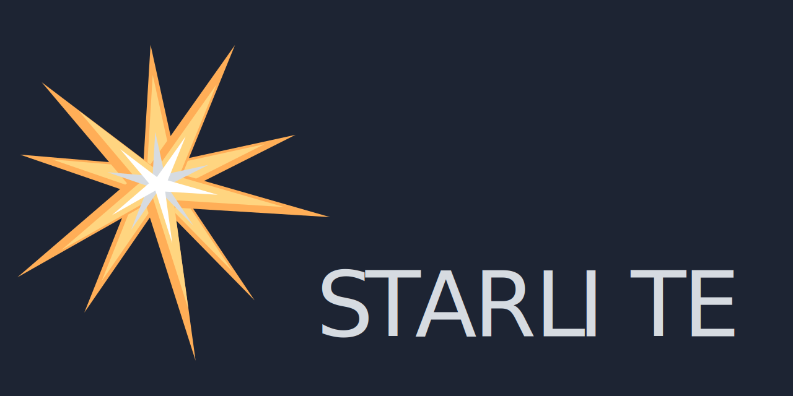

[](https://discord.gg/X3FJqy8d2j)
[](https://sonarcloud.io/summary/new_code?id=Goldziher_starlite)
[](https://sonarcloud.io/summary/new_code?id=Goldziher_starlite)
[](https://sonarcloud.io/summary/new_code?id=Goldziher_starlite)
[](https://sonarcloud.io/summary/new_code?id=Goldziher_starlite)
[](https://sonarcloud.io/summary/new_code?id=Goldziher_starlite)
[](https://sonarcloud.io/summary/new_code?id=Goldziher_starlite)


# Starlite

Starlite is a light, opinionated and flexible ASGI API framework built on top
of [pydantic](https://github.com/samuelcolvin/pydantic) and [Starlette](https://github.com/encode/starlette).

## Installation

Using your package manager of choice:

```shell
pip install starlite
```

OR

```shell
poetry add starlite
```

OR

```shell
pipenv install starlite
```

## Minimal Example

Define your data model using pydantic or any library based on it (see for example ormar, beanie, SQLModel etc.):

```python title="my_app/models/user.py"
from pydantic import BaseModel, UUID4


class User(BaseModel):
    first_name: str
    last_name: str
    id: UUID4
```

You can alternatively use a dataclass, either the standard library one or the one from pydantic:

```python title="my_app/models/user.py"
from uuid import UUID

# from pydantic.dataclasses import dataclass
from dataclasses import dataclass

@dataclass
class User:
    first_name: str
    last_name: str
    id: UUID
```

Define a Controller for your data model:

```python title="my_app/controllers/user.py"
from typing import List

from pydantic import UUID4
from starlite import Controller, Partial, get, post, put, patch, delete

from my_app.models import User


class UserController(Controller):
    path = "/users"

    @post()
    async def create_user(self, data: User) -> User:
        ...

    @get()
    async def list_users(self) -> List[User]:
        ...

    @patch(path="/{user_id:uuid}")
    async def partially_update_user(self, user_id: UUID4, data: Partial[User]) -> User:
        ...

    @put(path="/{user_id:uuid}")
    async def update_user(self, user_id: UUID4, data: User) -> User:
        ...

    @get(path="/{user_id:uuid}")
    async def get_user(self, user_id: UUID4) -> User:
        ...

    @delete(path="/{user_id:uuid}")
    async def delete_user(self, user_id: UUID4) -> User:
        ...
```

Import your controller into your application's entry-point and pass it to Starlite when instantiating your app:

```python title="my_app/main.py"
from starlite import Starlite

from my_app.controllers.user import UserController

app = Starlite(route_handlers=[UserController])
```

To run you application, use an ASGI server such as [uvicorn](https://www.uvicorn.org/):

```shell
uvicorn my_app.main:app --reload
```

## The Starlite Project

This project builds on top the Starlette ASGI toolkit and pydantic modelling to create a higher-order opinionated
framework. The idea to use these two libraries as a basis is of course not new - it was first done in FastAPI, which in
this regard (and some others) was a source of inspiration for this framework. Nonetheless, Starlite is not FastAPI - it
has a different design, different project goals and a completely different codebase.

1. The goal of this project is to become a community driven project. That is, not to have a single "owner" but rather a
   core team of maintainers that leads the project, as well as community contributors.
2. Starlite draws inspiration from NestJS - a contemporary TypeScript framework - which places opinions and patterns at
   its core. As such, the design of the API breaks from the Starlette design and instead offers an opinionated
   alternative.
3. Finally, Python OOP is extremely powerful and versatile. While still allowing for function based endpoints, Starlite
   seeks to build on this by placing class based Controllers at its core.
