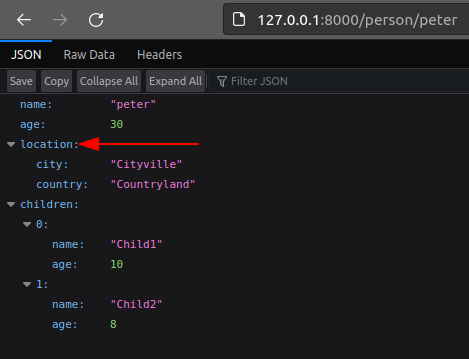

Renaming fields
---------------

The name of a field that is used for serialization can be changed by either explicitly declaring the new name or by
declaring a renaming strategy.

Explicitly renaming fields
==========================

We can rename fields explicitly using the :attr:`rename_fields <litestar.dto.config.DTOConfig.rename_fields>`
attribute. This attribute is a dictionary that maps the original field name to the new field name.

In this example, we rename the ``address`` field to ``location``:

.. literalinclude:: /examples/data_transfer_objects/factory/tutorial/explicit_field_renaming.py
   :language: python
   :linenos:
   :emphasize-lines: 28

Notice how the ``address`` field is renamed to ``location``.

Field renaming strategies
=========================

Instead of explicitly renaming fields, we can also use a field renaming strategy.

The field renaming strategy is specified using the
:attr:`rename_strategy <litestar.dto.config.DTOConfig.rename_strategy>` config.

Litestar supports the following strategies:

- ``lower``: Converts the field name to lowercase
- ``upper``: Converts the field name to uppercase
- ``camel``: Converts the field name to camel case
- ``pascal``: Converts the field name to pascal case

.. note::

    You can also define your own strategies by passing a callable that receives the field name, and returns the new
    field name to the ``rename_strategy`` config.

Let's modify our example to use the ``upper`` strategy:

.. literalinclude:: /examples/data_transfer_objects/factory/tutorial/field_renaming_strategy.py
   :language: python
   :linenos:
   :emphasize-lines: 28

And the result:

.. image:: images/field_renaming_strategy.png
    :align: center
