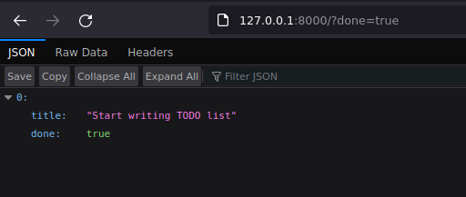
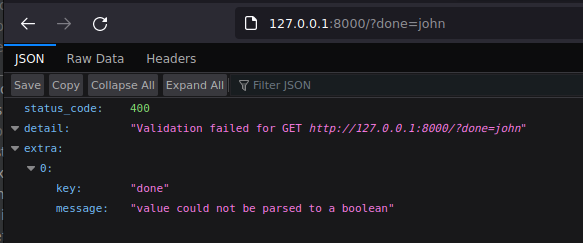
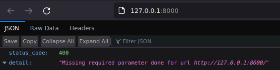

The TODO application
====================

Getting a list
--------------

The first thing we're going to set up for our app is a route handler that returns a
single TODO-list. A TODO-list in our case will be a list of dictionaries representing
the items on that list.

.. literalinclude:: examples/get_list/dict.py
    :language: python
    :caption: app.py
    :linenos:

If you run the app and visit http://127.0.0.1:8000/ in your browser you'll see the
following output:

.. figure:: images/get_todo_list.png

    Suddenly, JSON

Because we annotated our function with ``List[Dict[str, Union[str, bool]]]``, Litestar
infers that we want our data serialized as JSON:

.. literalinclude:: examples/get_list/dict.py
    :language: python
    :lineno-start: 13
    :lines: 13

Cleaning up the example with dataclasses
++++++++++++++++++++++++++++++++++++++++

Since these type annotations can become unwieldy quite easily, let's make our lives
simpler by using dataclasses instead:

.. literalinclude:: examples/get_list/dataclass.py
    :caption: app.py
    :language: python
    :linenos:

This looks a lot cleaner and we have now the added benefit of being able to work with
dataclasses instead of plain dictionaries. The result will still be the same: Litestar
knows how to turn these dataclasses into JSON and will do so for us automatically.

.. tip::
    In addition to dataclasses, Litestar supports many more types such as
    :class:`TypedDict <typing.TypedDict>`, :class:`NamedTuple <typing.NamedTuple>`,
    `Pydantic models <https://docs.pydantic.dev/usage/models/>`_ or
    `attrs classes <https://www.attrs.org/en/stable/>`_

Filtering the list using query parameters
-----------------------------------------

Currently our route handler will always return all items on our list. But what if we
are interested in only those items with a specific status, for example all items that
are not yet marked as *done*?

For this we can employ query parameters. To define a query parameter, all that's needed
is to add an otherwise unused parameter to the function. Litestar will recognize this
and infer that it's going to be used as a query parameter.

.. literalinclude:: examples/get_list/query_param.py
    :caption: app.py
    :language: python
    :linenos:

    Visiting http://127.0.0.1:8000?done=true will give us all the TODOs that have been
    marked as *done*

.. figure:: images/todos-not-done.png

    while http://127.0.0.1:8000?done=false will return only those not yet done

While this does seem to work just fine, you might be able to spot two problems with it:

1. If a user input anything else than ``?done=true``, it would still return not-done
   items. ``?done=john`` for example works just like ``?done=false``
2. What happens if a user does not supply the query parameter at all?

Let's address these one by one.

An easy solution to problem 1 would be to simply check if the query parameter is either
``true`` or ``false``?, and return a response with an HTTP status code that indicates an
error if it's something else:

.. literalinclude:: examples/get_list/query_param_validate_manually.py
    :caption: app.py
    :language: python
    :linenos:

If the query parameter equals ``true``, return all items that have ``done=True``:

.. literalinclude:: examples/get_list/query_param_validate_manually.py
    :language: python
    :caption: app.py
    :lines: 23-24
    :dedent: 2
    :linenos:
    :lineno-start: 23

If the query parameter equals ``false``, return all items that have ``done=False``:

.. literalinclude:: examples/get_list/query_param_validate_manually.py
    :language: python
    :caption: app.py
    :lines: 25-26
    :dedent: 2
    :linenos:
    :lineno-start: 25

And if the query parameter has any other value, we raise :exc:`HTTPException`. Raising
an ``HTTPException`` tells Litestar that something went wrong, and instead of returning
a normal response, it will send a response with the HTTP status code we gave it (``400``
in this case), a message about the error we supplied.

.. literalinclude:: examples/get_list/query_param_validate_manually.py
    :language: python
    :caption: app.py
    :lines: 27
    :dedent: 2
    :linenos:
    :lineno-start: 27

.. figure:: images/done-john.png

    If we try to access http://127.0.0.1?done=john now, we will get this error message

While this does what we want, you're probably thinking
`"there must be a better way!" <https://github.com/rhettinger>`_. And there is! Instead
of doing these things manually, you can also just let Litestar handle them for you!

Converting and validating query parameters
++++++++++++++++++++++++++++++++++++++++++

As we learned earlier, type annotations can be used for more than static type checking
in Litestar; They can also define and configure behaviour. In this case, we can get
Litestar to convert our query parameter to a boolean value, matching the values of our
``TodoItem.done`` attribute, and in the same step validate it, returning error responses
for us should the supplied value not be a valid boolean.

.. literalinclude:: examples/get_list/query_param_validate.py
    :language: python
    :caption: app.py
    :linenos:

    Trying out our example from before (visit http://127.0.0.1:8000?done=john), we now
    get this descriptive error message

**What's happening here?**

Since we used :class:`bool` as the type annotation for the ``done`` parameter, Litestar
will try to convert the value into a :class:`bool` first. Since ``john`` is not a
representation of a boolean value, it will return an error response instead.

.. literalinclude:: examples/get_list/query_param_validate.py
    :language: python
    :caption: app.py
    :lines: 21
    :linenos:
    :lineno-start: 21

.. tip::
    It is important to note that this conversion is not the result of calling
    :class:`bool` on the raw value. ``bool("john")`` would be ``True``, since Python
    considers all non-empty stringy to be truthy.

    Litestar however supports customary boolean representation commonly used in the HTTP
    world; ``true`` and ``1`` are both converted to :obj:`True`, while ``false``
    and ``0`` are converted to be :obj:`False`.

If the conversion is successful however, we now have a :class:`bool` instance, and can
simply use that for comparison against the ``TodoItem.done`` attribute:

.. literalinclude:: examples/get_list/query_param_validate.py
    :language: python
    :caption: app.py
    :lines: 22
    :dedent: 2
    :linenos:
    :lineno-start: 22

.. seealso::
    :ref:`usage/parameters:type coercion`

Making the query parameter optional
+++++++++++++++++++++++++++++++++++

We have one problem left to solve, and that is, what happens when want to get **all**
items, and omit the query parameter?

    Omitting the ``?done`` query parameter will result in an error

Because we defined the query parameter as ``done: bool`` without giving it a default
value, it will be treated as a required parameter - just like a regular function
parameter. If instead we want this to be optional, we have to supply a default value.

.. literalinclude:: examples/get_list/query_param_default.py
    :language: python
    :caption: app.py
    :linenos:

.. figure:: images/get_todo_list.png

    Visiting http://localhost:8000 again, we now don't get an error anymore if we omit
    the query parameter

.. tip::
    In this instance, we set the default to :obj:`None`, since we don't want to do any
    filtering if no ``done`` status is specified. If instead we wanted to only display
    not-done items by default, we could set the value to :obj:`False` instead.

.. seealso::
    :ref:`usage/parameters:query parameters`
