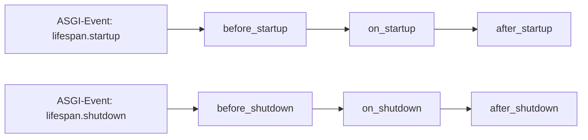

# The Starlite App

## Application object

At the root of every Starlite application is an instance of the [`Starlite`][starlite.app.Starlite]
class. Typically, this code will be placed in a file called `main.py` at the project's root directory.

Creating an app is straightforward – the only required arg is a list
of [Controllers](1-routing/3-controllers.md#controllers), [Routers](1-routing/2-routers.md)
or [Route Handlers](2-route-handlers/1-http-route-handlers.md):

```py title="Hello World"
--8<-- "examples/hello_world.py"
```

The app instance is the root level of the app - it has the base path of `/` and all root level Controllers, Routers
and Route Handlers should be registered on it.

!!! info "Learn more"
    To learn more about registering routes, check out this chapter
    in the documentation: [registering routes](1-routing/1-registering-routes.md)

    See the [API Reference][starlite.app.Starlite] for details on the `Starlite`
    class and the kwargs it accepts.


## Startup and Shutdown

You can pass a list of callables - either sync or async functions, methods or class instances - to the `on_startup`
/ `on_shutdown` kwargs of the [Starlite instance][starlite.app.Starlite]. Those will be called in
order, once the ASGI server (uvicorn, daphne etc.) emits the respective event.




A classic use case for this is database connectivity. Often, we want to establish a database connection on application
startup, and then close it gracefully upon shutdown.

For example, lets create a database connection using the async engine from
[SQLAlchemy](https://docs.sqlalchemy.org/en/latest/orm/extensions/asyncio.html). We create two functions, one to get or
establish the connection, and another to close it, and then pass them to the Starlite constructor:

```py title="Startup and Shutdown"
--8<-- "examples/startup_and_shutdown.py"
```


## Using Application State
<!-- markdownlint-disable -->
As seen in the examples for the [on_startup](#before-after-startup) / [on_shutdown](#before-after-shutdown),
callables passed to these hooks can receive an optional kwarg called `state`, which is the application's state object.
<!-- markdownlint-restore -->
The advantage of using application `state`, is that it can be accessed during multiple stages of the connection, and
it can be injected into dependencies and route handlers.

The Application State is an instance of the [`State`][starlite.datastructures.State] datastructure, and it is accessible
via the
[`app.state`][starlite.app.Starlite] attribute. As such it can be accessed wherever the app instance is accessible.

It's important to understand in this context that the application instance is injected into the ASGI `scope` mapping for
each connection (i.e. request or websocket connection) as `scope["app"].state`. This makes the application accessible
wherever the scope mapping is available, e.g. in middleware, on [`Request`][starlite.connection.Request] and
[`Websocket`][starlite.connection.WebSocket] instances (accessible as `request.app` / `socket.app`) and many other
places.

Therefore, state offers an easy way to share contextual data between disparate parts of the application, as seen below:

```py title="Using Application State"
--8<-- "examples/application_state/using_application_state.py"
```

### Initializing Application State

You can pass an object from which the application state will be instantiated using the `initial_state` kwarg of the
Starlite constructor:

```py title="Using Application State"
--8<-- "examples/application_state/passing_initial_state.py"
```

!!! note
    The `initial_state` can be a dictionary, an instance of [`ImmutableState`][starlite.datastructures.ImmutableState]
    or [`State`][starlite.datastructures.State], or a list of tuples containing key/value pairs.

!!! important
    Any value passed to `initial_state` will be deep copied - to prevent mutation from outside the application context.

### Injecting Application State into Route Handlers and Dependencies

As seen in the above example, Starlite offers an easy way to inject state into route handlers and dependencies - simply
by specifying `state` as a kwarg to the handler function. I.e., you can simply do this in handler function or dependency
to access the application state:

```python
from starlite import get, State


@get("/")
def handler(state: State) -> None:
    ...
```

When using this pattern you can specify the class to use for the state object. This type is not merely for type
checkers, rather Starlite will instantiate a new state instance based on the type you set there. This allows users to
use custom classes for State, e.g.:

While this is very powerful, it might encourage users to follow anti-patterns: it's important to emphasize that using
state can lead to code that's hard to reason about and bugs that are difficult to understand, due to changes in
different ASGI contexts. As such, this pattern should be used only when it is the best choice and in a limited fashion.
To discourage its use, Starlite also offers a builtin `ImmutableState` class. You can use this class to type state and
ensure that no mutation of state is allowed:

```py title="Using Custom State"
--8<-- "examples/application_state/using_immutable_state.py"
```


## Static Files

Static files are served by the app from predefined locations. To configure static file serving, either pass an
instance of [`StaticFilesConfig`][starlite.config.static_files.StaticFilesConfig] or a list
thereof to the [Starlite constructor][starlite.app.Starlite] using the `static_files_config` kwarg.

For example, lets say our Starlite app is going to serve **regular files** from the `my_app/static` folder and **html
documents** from the `my_app/html` folder, and we would like to serve the **static files** on the `/files` path,
and the **html files** on the `/html` path:

```python
from starlite import Starlite, StaticFilesConfig

app = Starlite(
    route_handlers=[...],
    static_files_config=[
        StaticFilesConfig(directories=["static"], path="/files"),
        StaticFilesConfig(directories=["html"], path="/html", html_mode=True),
    ],
)
```


Matching is done based on filename, for example, assume we have a request that is trying to retrieve the path
`/files/file.txt`, the **directory for the base path** `/files` **will be searched** for the file `file.txt`. If it is
found, the file will be sent, otherwise a **404 response** will be sent.

If `html_mode` is enabled and no specific file is requested, the application will fall back to serving `index.html`. If
no file is found the application will look for a `404.html` file in order to render a response, otherwise a 404
[`NotFoundException`][starlite.exceptions.NotFoundException] will be returned.

You can provide a `name` parameter to `StaticFilesConfig` to identify the given config and generate links to files in
folders belonging to that config. `name` should be a unique string across all static configs and
[route handlers](2-route-handlers/4-route-handler-indexing.md).

```python
from starlite import Starlite, StaticFilesConfig

app = Starlite(
    route_handlers=[...],
    static_files_config=[
        StaticFilesConfig(
            directories=["static"], path="/some_folder/static/path", name="static"
        ),
    ],
)

url_path = app.url_for_static_asset("static", "file.pdf")
# /some_folder/static/path/file.pdf
```


### Sending files as attachments

By default, files are sent "inline", meaning they will have a `Content-Disposition: inline` header.
To send them as attachments, use the `send_as_attachment=True` flag, which will add a
`Content-Disposition: attachment` header:

```python
from starlite import Starlite, StaticFilesConfig

app = Starlite(
    route_handlers=[...],
    static_files_config=[
        StaticFilesConfig(
            directories=["static"],
            path="/some_folder/static/path",
            name="static",
            send_as_attachment=True,
        ),
    ],
)
```

### File System support and Cloud Files

The [`StaticFilesConfig`][starlite.config.static_files.StaticFilesConfig] class accepts a value called `file_system`,
which can be any class adhering to the Starlite [`FileSystemProtocol`][starlite.types.FileSystemProtocol].

This protocol is similar to the file systems defined by [fsspec](https://filesystem-spec.readthedocs.io/en/latest/),
which cover all major cloud providers and a wide range of other use cases (e.g. HTTP based file service, `ftp` etc.).

In order to use any file system, simply use [fsspec](https://filesystem-spec.readthedocs.io/en/latest/) or one of
the libraries based upon it, or provide a custom implementation adhering to the
[`FileSystemProtocol`][starlite.types.FileSystemProtocol].


## Logging

Starlite has builtin pydantic based logging configuration that allows users to easily define logging:

```python
from starlite import Starlite, LoggingConfig, Request, get


@get("/")
def my_router_handler(request: Request) -> None:
    request.logger.info("inside a request")
    return None


logging_config = LoggingConfig(
    loggers={
        "my_app": {
            "level": "INFO",
            "handlers": ["queue_listener"],
        }
    }
)

app = Starlite(route_handlers=[my_router_handler], logging_config=logging_config)
```

!!! important
    Starlite configures a non-blocking `QueueListenerHandler` which
    is keyed as `queue_listener` in the logging configuration. The above example is using this handler,
    which is optimal for async applications. Make sure to use it in your own loggers as in the above example.

### Using Picologging

[Picologging](https://github.com/microsoft/picologging) is a high performance logging library that is developed by
Microsoft. Starlite will default to using this library automatically if its installed - requiring zero configuration on
the part of the user. That is, if `picologging` is present the previous example will work with it automatically.

### Using StructLog

[StructLog](https://www.structlog.org/en/stable/) is a powerful structured-logging library. Starlite ships with a dedicated
logging config for using it:

```python
from starlite import Starlite, StructLoggingConfig, Request, get


@get("/")
def my_router_handler(request: Request) -> None:
    request.logger.info("inside a request")
    return None


logging_config = StructLoggingConfig()

app = Starlite(route_handlers=[my_router_handler], logging_config=logging_config)
```

### Subclass Logging Configs

You can easily create you own `LoggingConfig` class by subclassing
[`BaseLoggingConfig`][starlite.config.logging.BaseLoggingConfig] and
implementing the `configure` method.


## Application Hooks

Starlite includes several application level hooks that allow users to run their own sync or async callables. While you
are free to use these hooks as you see fit, the design intention behind them is to allow for easy instrumentation for
observability (monitoring, tracing, logging etc.).

!!! Note
    All application hook kwargs detailed below receive either a single callable or a list of callables.
    If a list is provided, it is called in the order it is given.

### Before / After Startup

The `before_startup` and `after_startup` hooks take a [sync or async callable][starlite.types.LifeSpanHookHandler] that
receives the Starlite application as an argument and run during the ASGI startup event. The callable is invoked
respectively before or after the list of callables defined in the `on_startup` list of callables.

```py title="Before and After Startup Hooks"
--8<-- "examples/application_hooks/startup_hooks.py"
```

### Before / After Shutdown

The `before_shutdown` and `after_shutdown` are basically identical, with the difference being that the
[callable they receive][starlite.types.LifeSpanHookHandler] in callable is invoked respectively before or after the
list of callables defined in the `on_shutdown` list of callables.

```py title="Before and After Shutdown Hooks"
--8<-- "examples/application_hooks/shutdown_hooks.py"
```

### After Exception

The `after_exception` hook takes a [sync or async callable][starlite.types.AfterExceptionHookHandler] that is called with
three arguments: the `exception` that occurred, the ASGI `scope` of the request or websocket connection and the
application `state`.

```py title="After Exception Hook"
--8<-- "examples/application_hooks/after_exception_hook.py"
```

!!! important
    This hook is not meant to handle exceptions - it just receives them to allow for side effects.
    To handle exceptions you should define [exception handlers](17-exceptions.md#exception-handling).

### Before Send

The `before_send` hook takes a [sync or async callable][starlite.types.BeforeMessageSendHookHandler] that is called when
an ASGI message is sent. The hook receives the message instance and the application state.

```py title="Before Send Hook"
--8<-- "examples/application_hooks/before_send_hook.py"
```


### Application Init

Starlite includes a hook for intercepting the arguments passed to the [Starlite constructor][starlite.app.Starlite],
before they are used to instantiate the application.

Handlers can be passed to the `on_app_init` parameter on construction of the application, and in turn, each will receive
an instance of [`AppConfig`][starlite.config.app.AppConfig] and must return an instance of same.

This hook is useful for applying common configuration between applications, and for use by developers who may wish to
develop third-party application configuration systems.

!!! Note
    `on_app_init` handlers cannot be `async def` functions, as they are called within `Starlite.__init__()`, outside of
    an async context.

```py title="After Exception Hook"
--8<-- "examples/application_hooks/on_app_init.py"
```


## Layered architecture

Starlite has a layered architecture compromising of (generally speaking) 4 layers:

1. The application object
2. Routers
3. Controllers
4. Handlers

There are many parameters that can be defined on every layer, in which case the parameter
defined on the layer **closest to the handler** takes precedence. This allows for maximum
flexibility and simplicity when configuring complex applications and enables transparent
overriding of parameters.

Parameters that support layering are:

- [`after_request`](/starlite/usage/13-lifecycle-hooks/#after-request)
- [`after_response`](/starlite/usage/13-lifecycle-hooks/#after-response)
- [`before_request`](/starlite/usage/13-lifecycle-hooks/#before-request)
- [`cache_control`](/starlite/usage/5-responses/4-response-headers/#cache-control)
- [`dependencies`](/starlite/usage/6-dependency-injection/0-dependency-injection-intro/)
- [`etag`](/starlite/usage/5-responses/4-response-headers/#etag)
- [`exception_handlers`](/starlite/usage/17-exceptions/#exception-handling)
- [`guards`](/starlite/usage/8-security/3-guards/)
- [`middleware`](/starlite/usage/7-middleware/0-middleware-intro/)
- [`opt`](/starlite/usage/2-route-handlers/5-handler-opts/)
- [`response_class`](/starlite/usage/5-responses/10-custom-responses/)
- [`response_cookies`](/starlite/usage/5-responses/4-response-cookies/)
- [`response_headers`](/starlite/usage/5-responses/4-response-headers/)
- `security`
- `tags`
- `type_encoders`
